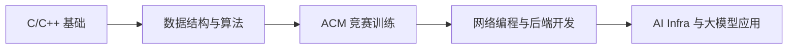

 

---

## About Me

我是 **AKO-JAY**，温州大学 **集成电路设计与集成系统** 本科生，ACM 校队预备队成员。  
目前主要关注 **算法竞赛、C/C++ 工程实践、后端开发、AI Infra 与大模型应用开发**。

<table>
  <tr>
    <td width="50%">

**Current Status**

- 温州大学本科在读，2025.09 - 至今
- GPA：3.5 / 4.5
- 班级排名：6 / 41，前 15%
- 持续参与 ACM 训练与程序设计实践

    </td>
    <td width="50%">

**Focus Areas**

- 数据结构与算法：DP、图论、STL、搜索
- C/C++：OOP、网络编程、多线程基础
- AI 与视觉：YOLO、OpenCV、模型推理
- 工程工具：Linux、Docker、Git、WSL

    </td>
  </tr>
</table>

---

## Tech Stack

 
 

---

## Featured Project

### Multiplayer Aircraft Battle Game

> 基于 **C++** 的多人联网飞机大战游戏，围绕客户端/服务器通信、玩家状态同步、游戏状态管理与网络对战体验进行开发。

| Module | What I Built |
| --- | --- |
| Core Gameplay | 玩家移动、射击、敌机生成、积分与生命值系统 |
| Collision System | 子弹、玩家、敌机之间的碰撞检测与状态更新 |
| Network Layer | 客户端与服务器通信，玩家位置与状态同步 |
| Game Architecture | 游戏状态管理、模块拆分、Git 版本管理 |
| Optimization Direction | 网络延迟补偿、客户端插值、同步体验优化 |

**Tech Stack:** `C++` `Socket` `C/S Architecture` `OOP` `Multithreading Basics` `Git`

---

## Competitions

| Time | Competition | Result |
| --- | --- | --- |
| 2026.03 | 温州大学第十九届"小橙编程科技杯"大学生程序设计竞赛 | 二等奖 |
| 2025.12 | 温州大学计算机与人工智能学院第七届新生程序设计竞赛 | 三等奖 |
| 2025 - Now | ACM 校队预备队训练 | 持续训练 |

---

## Learning Roadmap

---

## GitHub Dashboard

 
 

---

## Direction

- **Algorithm Engineering:** 用竞赛训练提升复杂问题拆解能力
- **Backend Development:** 继续深入 C++ 网络编程与服务端架构
- **AI Infra:** 学习模型部署、推理优化与工程化链路
- **LLM Applications:** 探索大模型应用开发与智能工具构建

---

**Last Updated:** 2026-06-15

